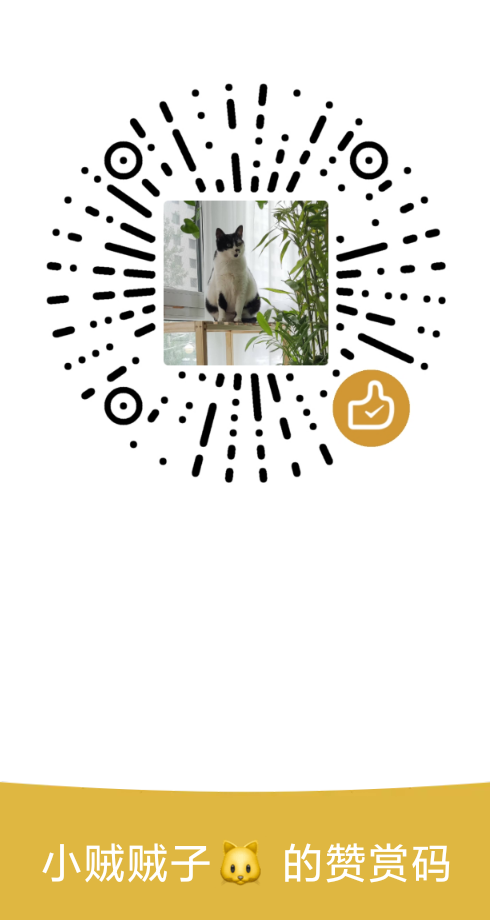
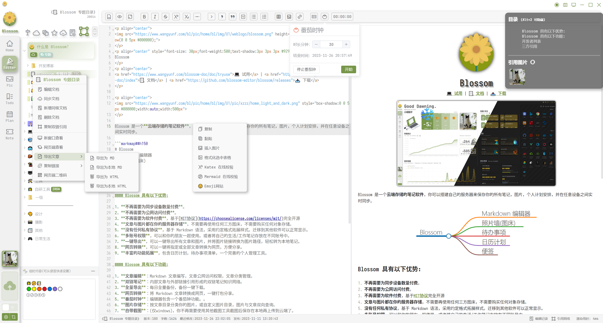
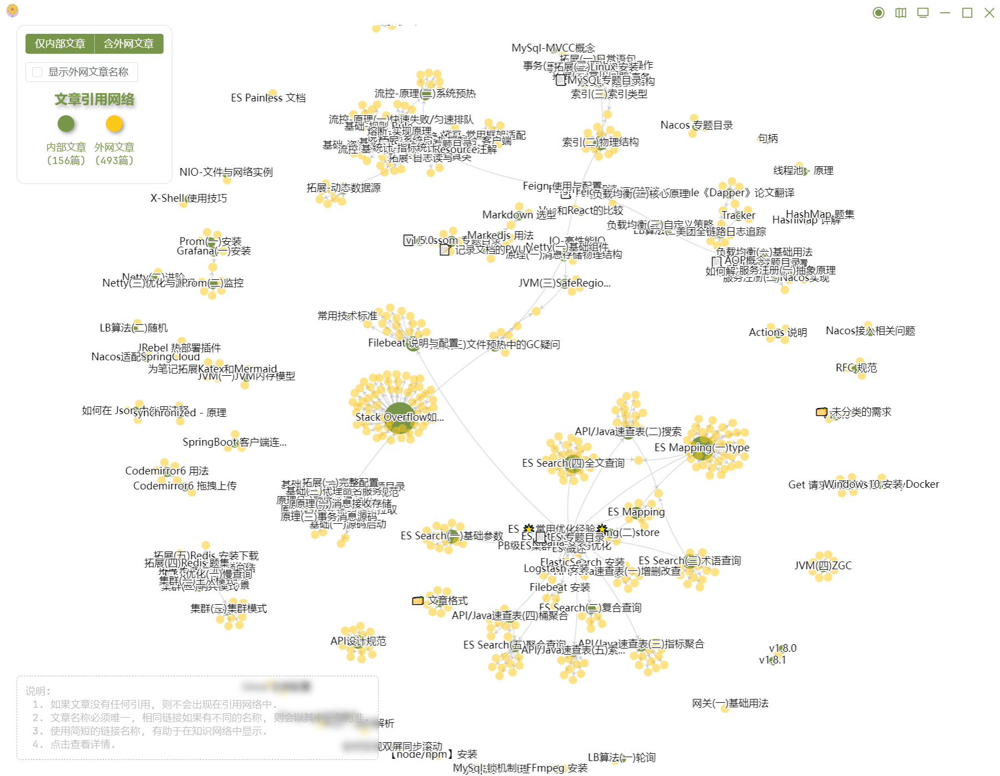
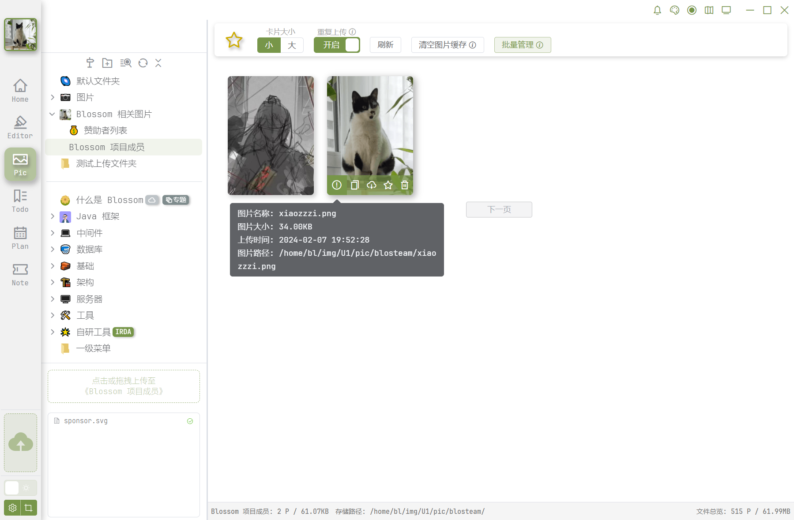
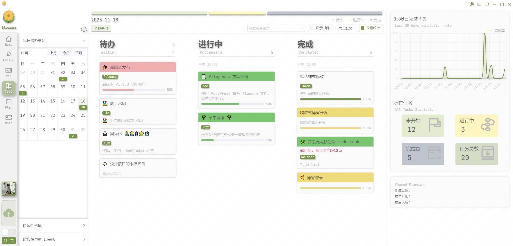
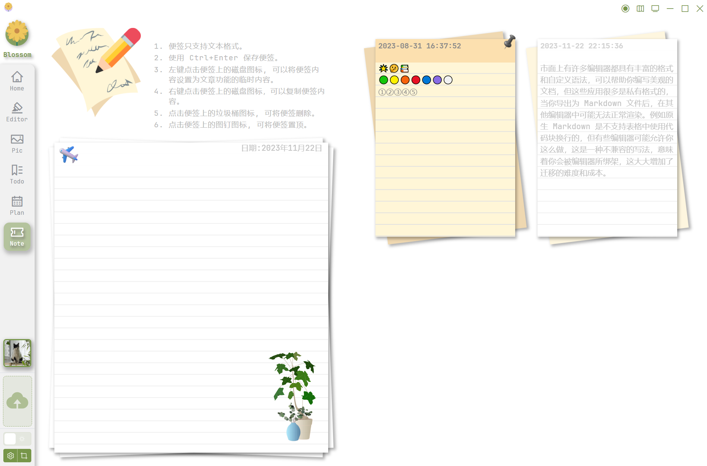
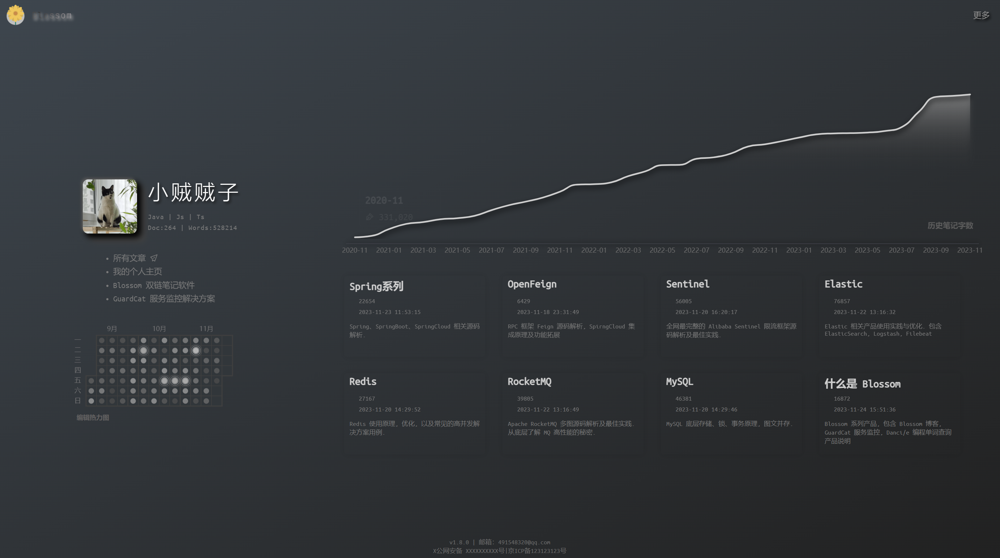
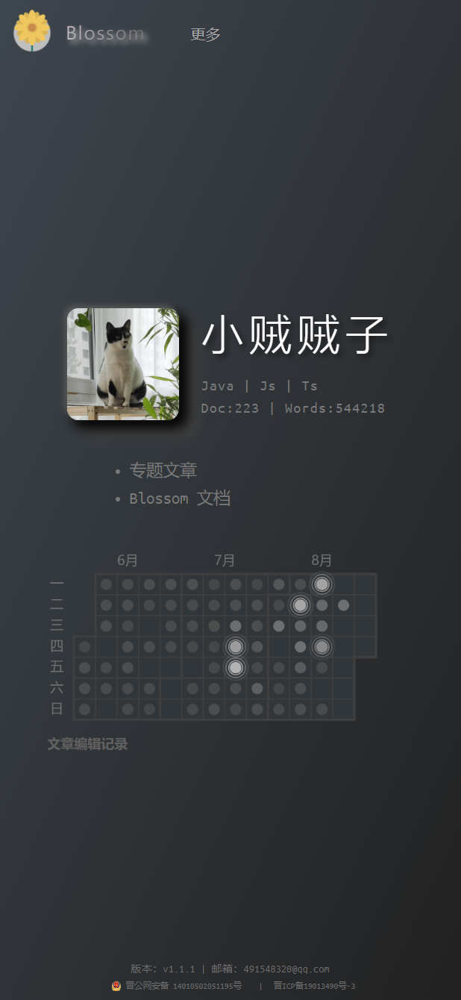
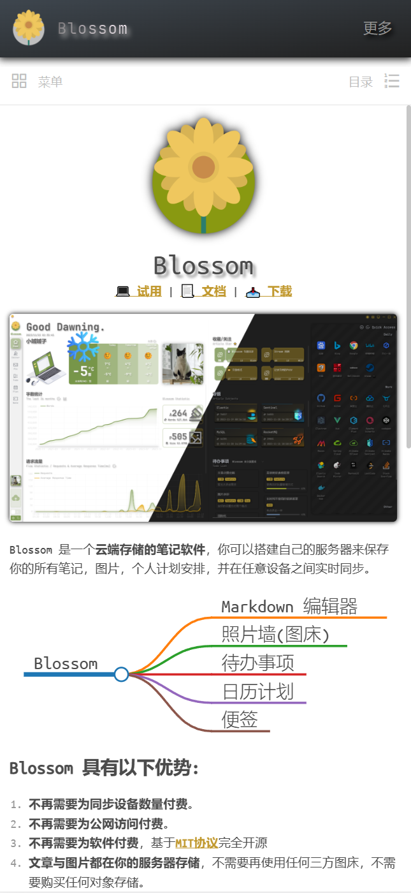

<p align="center">

</p>
<p align="center">
<a href="https://www.blossom-editor.org/">📃 Document</a> | <a href="https://www.blossom-editor.org/">📥 Download</a> 
</p>

Blossom is a note-taking software which support **self-hosted** and **cloud-based dual-chain storing**，You can store your notes, images, and personal schedules on your own server and synchronize them in real-time across any device. It also functions as a dynamic blog。

It can running on Windows，Mac，web-based clients, and mobile web interfaces.

<p align="center">

</p>

<br/><br/>

# 👏 Blossom Feature:

### Complete & Self-Contained

Blossom doesn't rely on any third-party storage or image hosting; it functions as its own image hosting service. It offers comprehensive image management, anti-deletion measures, and establishes bidirectional relationships between images and articles.

You can write in Markdown with non-destructive syntax extensions, content created here can be displayed correctly in any Markdown software.

### Quick Migration

All images and articles support one-click backup and export, making migration easy within minutes. The exported files can seamlessly be opened with local software like VS Code or Obsidian.

### Additional Features

- 📅 Schedule
- 🏷️ To-Do
- 🎫 QuickNote
- 🍅 Pomodoro Timer
- 🧰 Multi-user support, word count statistics, word count trend chart, editing heatmap, weather forecast, theme settings, and more...

Blossom boasts a wealth of features, serving not only as a knowledge management tool but also as a comprehensive and practical utility for simultaneous multi-user usage.

<br/><br/>

# 🚀 Docker Compose in One Click

```
docker compose -f docker/compose/blossom-mysql8.yaml up -d
```

<br/><br/>

# 🛠️ 拓展工具

[为知笔记迁移Blossom工具](https://github.com/kidultff/wiz2blossom)

<br/><br/>

# 🥳 Contact

Join QQ group, communicate with us and discuss problems.

- Group 1：522359970 (It is full)
- Group 2：921906098 (It is full)
- Group 3：749721525

You can also contact with us by the issue , We will definitely try our best to reply to you.
We also welcome everyone to participate in the development and discussion of Blossom.

<p align="center">


</p>

# 🤝 Sponsor Blossom

**Blossom No charges will be applied ; you can use it permanently for free!**

However, sustaining a livelihood through open-source software is challenging. The project's design, development, and testing demand considerable time and effort. If you're willing to sponsor my work, it would significantly contribute to the project's growth and motivate me to continue long-term.

**Thanks to every sponsor for their strong support, Blossom becomes better because of all of you.**

### Thanks to the following sponsors: [Sponsors](./SPONSORS.md)

---

<h4 align="center">You can sponsor Blossom in the following way. </h4>

<p align="center">



</p>

<br/>

# More



<p align="center">Editor</p>

---



<p align="center">Dual-chain Notes</p>

---



<p align="center">Gallery</p>

---



<p align="center">To-Do</p>

---


<p align="center">Schedule</p>

---



<p align="center">Notes</p>

---



<p align="center">Blog</p>

<p align="center">


</p>
<p align="center">Mobile Blog</p>
                    
# Stargazers over time
[](https://starchart.cc/blossom-editor/blossom)
