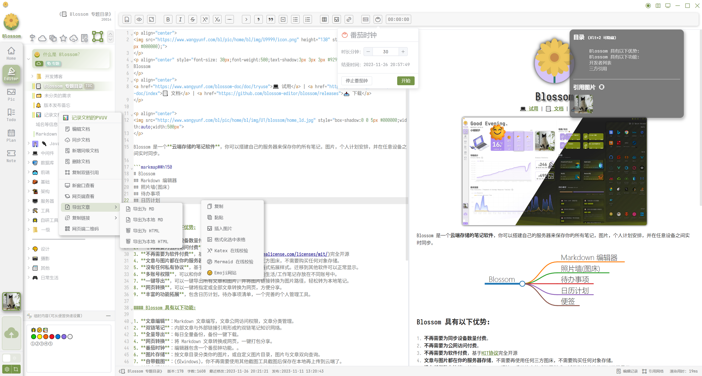
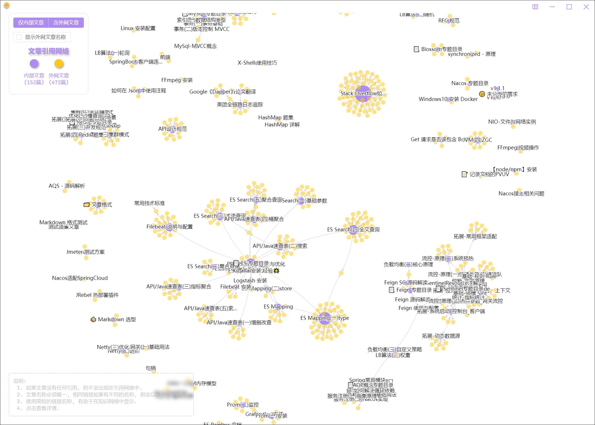
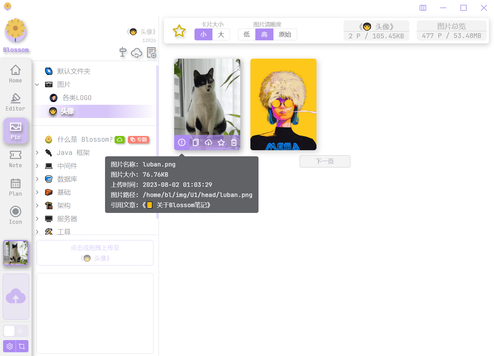
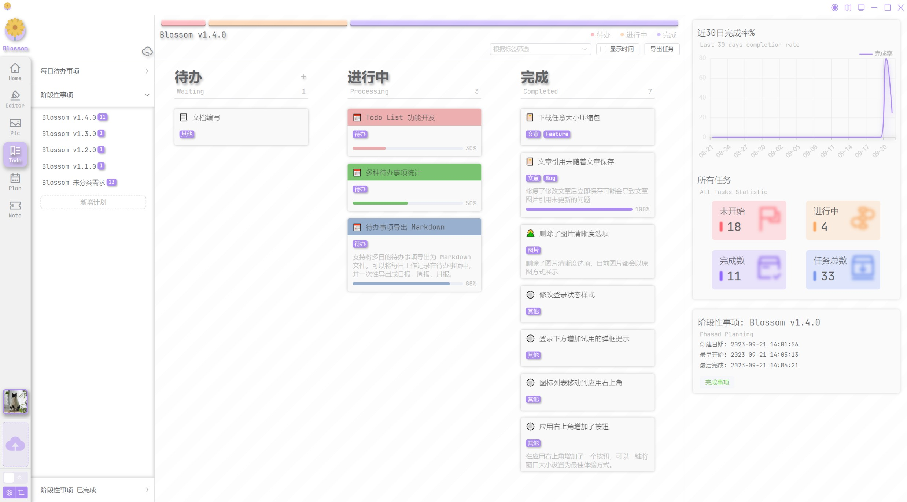
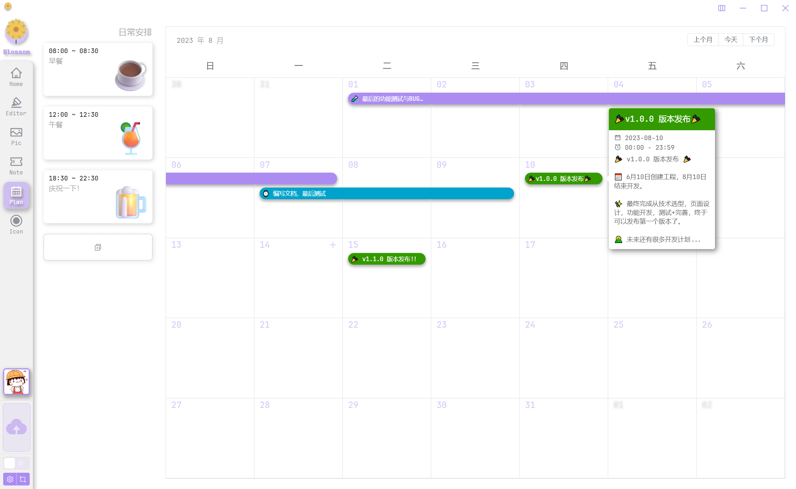
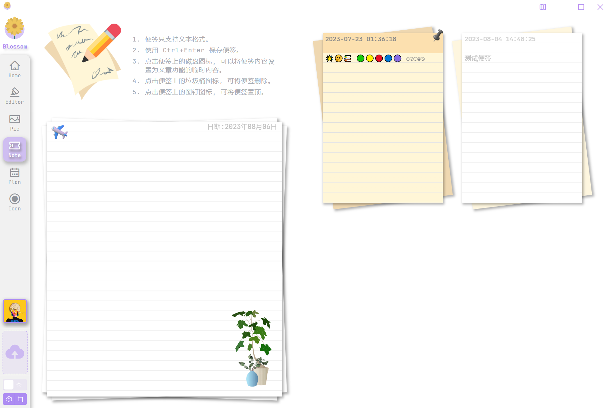
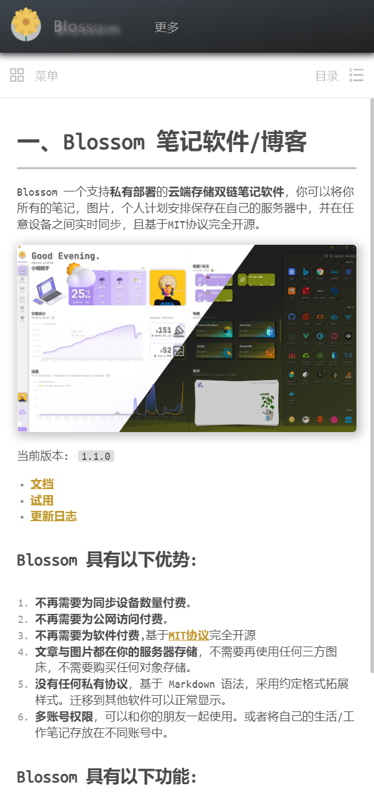

<p align="center">

</p>
<p align="center" style="font-size: 30px;font-weight:500;">
Blossom 1.5.0
</p>
<p align="center">
<a href="https://www.wangyunf.com/blossom-doc/doc/tryuse">💻️ 试用</a> | <a href="https://www.wangyunf.com/blossom-doc/index">📃 文档</a> | <a href="https://github.com/blossom-editor/blossom/releases">📥 下载</a> 
</p>

---

Blossom 是一个支持**私有部署**的**云端存储双链笔记软件**，你可以将你所有的笔记，图片，个人计划安排保存在自己的服务器中，并在任意设备之间实时同步，且基于MIT协议完全开源。

<p align="center">

</p>

- 你可以先进行[试用](https://www.wangyunf.com/blossom-doc/doc/tryuse)，我们提供了一个试用账号帮你体验该应用。
- 使用 [Docker / Docker Compose](https://www.wangyunf.com/blossom-doc/doc/backend) 进行部署。
- 阅读[文档](https://www.wangyunf.com/blossom-doc/index)来查看更多使用细节。

---

### 👏 Blossom 具有以下优势:

1. **不再需要为同步设备数量付费**。
2. **不再需要为公网访问付费**。
3. **不再需要为软件付费**,基于MIT协议完全开源
4. **文章与图片都在你的服务器存储**，不需要再使用任何三方图床，不需要购买任何对象存储。
5. **没有任何私有协议**，基于 Markdown 语法，采用约定格式拓展样式。迁移到其他软件可以正常显示。
6. **多账号权限**，可以和你的朋友一起使用。或者将自己的生活/工作笔记存放在不同账号中。
7. **一键导出**，可以一键导出所有文章和图片，并将图片链接转换为图片路径，轻松转为本地笔记。
8. **网页转换**，可以一键将指定或全部文章转换为网页，方便分享。
9. **丰富的功能拓展**，包含日历计划，待办事项清单，一个完善的个人管理工具。
10. **支持 Docker / Docker Compose 部署**。

### 🎁 Blossom 具有以下功能:
1. **文章编辑**：Markdown 文章编写，文章公网访问权限，文章分类管理。
2. **双链笔记**：内部文章与外部链接引用形成的双链笔记知识网络。
3. **全量导出**：每日全量备份，备份一键下载。
4. **网页转换**：将 Markdown 文章转换成网页，一键打包分享。
5. **番茄时钟**：编辑器包含一个番茄钟功能。。
6. **图片存储**：按文章目录分类你的图片，或自定义图片目录，图片与文章双向查询。
7. **自带截图**：(仅windows)，你不再需要使用其他截图工具截图后保存在本地再上传到云端了。
8. **待办清单**：以 Todo List 的方式管理你的每日事项或阶段性计划。
9. **计划安排**：阶段性的长期计划，或者日历中的短期计划安排。
10. **快捷便签**：方便你记录随意的日常信息。
11. **网站收藏**：常用网站快捷访问，或者说是一个书签功能。
12. 笔记总字数折线图，笔记编辑数量热力图，服务器请求量折线图等多种统计。

# 🚀 Docker Compose 一键部署

```
docker compose -f docker/compose/blossom-mysql8.yaml up -d
```


# 🌄 更多 Blossom 图片


<p align="center">编辑器</p>

---


<p align="center">双链笔记</p>

---


<p align="center">照片墙</p>

---


<p align="center">待办事项清单</p>

---


<p align="center">日历计划</p>

---


<p align="center">便签管理</p>

---


<p align="center">博客</p>

<p align="center">


</p>
<p align="center">博客移动端</p>

# 🥳 加入群聊

加入群聊进行沟通，反馈问题。


