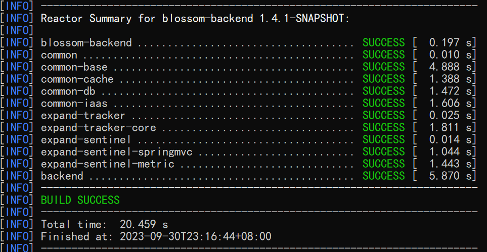
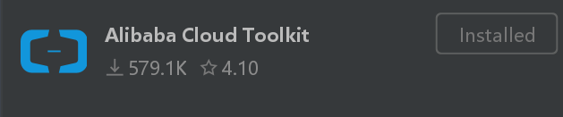
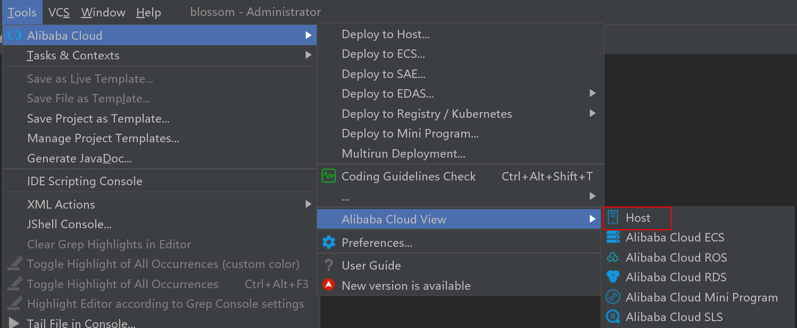
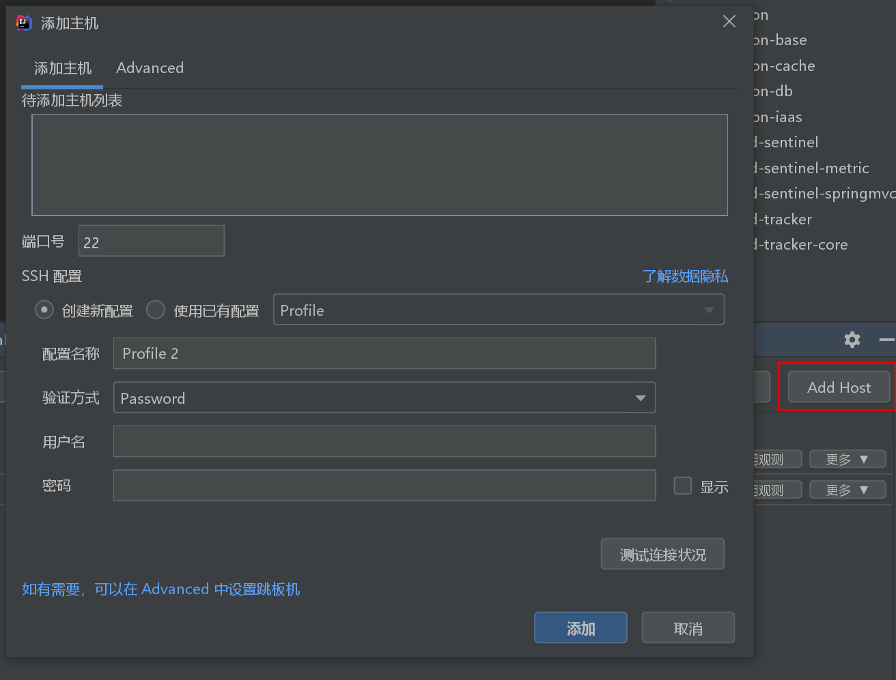
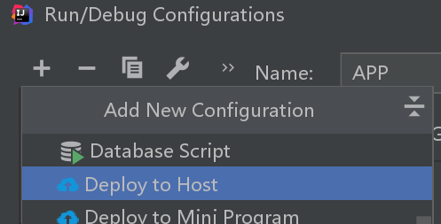
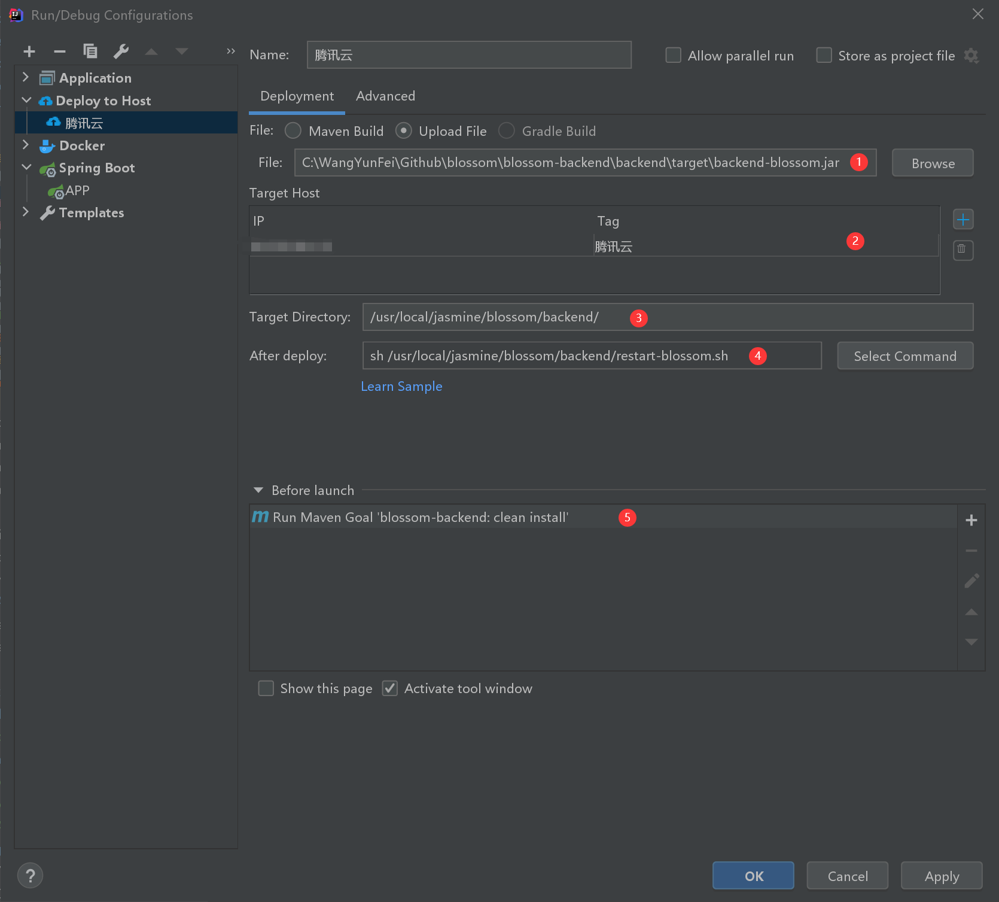

# 应用部署文档

本文说明了所有部署该应用的方式。

```
docker
 ├─ build                    镜像构建
 |  └─ Dockerfile            应用镜像构建脚本
 └─ compose                  docker compose 配置
    ├─ blossom.yaml          包含后台应用 Blossom-backend
    └─ blossom-mysql8.yaml   包含后台应用 Blossom-backend 与 MySql8
```

应用所需环境与版本

1. `JDK8`
2. `MySQL8+`

# 一、使用应用的公共镜像

## 1. 拉取MySQL镜像并启动

> 如果已安装数据库，可以跳过该步骤。

```bash
docker pull mysql:8.0.31
```

启动镜像示例

```bash
docker run \
-d \
--name mysql \
-e MYSQL_ROOT_PASSWORD=jasmine888 \
-p 3306:3306 \
-v /usr/local/docker/mysql/data:/var/lib/mysql \
-v /usr/local/docker/mysql-files/log:/var/lib/mysql-files \
-v /usr/local/docker/mysql/log:/var/log/mysql \
mysql:8.0.31
```

## 2. 创建数据库

你需要在 MySQL 中先创建一个数据库，数据库名称与启动容器时的`--spring.datasource.url`配置的数据库名称相同，如果不需要自定义数据库名称，你可以直接使用如下语句创建数据库：

```sql
CREATE DATABASE `blossom` DEFAULT CHARACTER SET utf8mb4 COLLATE utf8mb4_bin;
```

## 3. 拉取镜像

```
docker pull jasminexzzz/blossom:latest
```

## 4. 启动容器

启动示例

```bash
docker run -d \
  # 容器名称
  --name blossom-backend \
  # 指定端口映射
  -p 9999:9999 \
  # 挂载图片保存路径，如果是windows环境，可以使用/c/home/bl/来指定磁盘
  -v /home/bl/:/home/bl/ \
  # 启动的镜像名称
  jasminexzzz/blossom:latest \
  # 使用的后台配置文件，不需要修改
  --spring.profiles.active=prod \
  # 配置图片上传后对应生成的访问URL，需要以/pic/结尾。注意，该访问URL需要与访问后台的域名和端口相同
  --project.iaas.blos.domain="http://127.0.0.1:9999/pic/" \
  # 配置图片保存的磁盘路径，请使用 -v 将该路径挂载为本地路径，如上方示例
  --project.iaas.blos.default-path="/home/bl/img/" \
  # 配置数据库访问地址
  --spring.datasource.url="jdbc:mysql://192.168.31.99:3306/blossom?useUnicode=true&characterEncoding=utf-8&allowPublicKeyRetrieval=true&allowMultiQueries=true&useSSL=false&&serverTimezone=GMT%2B8" \
  # 配置数据库用户名
  --spring.datasource.username=root \
  # 配置数据库密码
  --spring.datasource.password=jasmine888
```

windows 控制台如下

```bash
docker run -d --name blossom-backend -p 9999:9999 -v /home/bl/:/home/bl/ jasminexzzz/blossom:latest --spring.profiles.active=prod --project.iaas.blos.domain="http://127.0.0.1:9999/pic/" --project.iaas.blos.default-path="/home/bl/img/" --spring.datasource.url="jdbc:mysql://192.168.31.99:3306/blossom?useUnicode=true&characterEncoding=utf-8&allowPublicKeyRetrieval=true&allowMultiQueries=true&useSSL=false&&serverTimezone=GMT%2B8" --spring.datasource.username=root --spring.datasource.password=jasmine888
```

# 二、使用 docker compose 拉取镜像

可以使用 docker compose 单独拉取应用镜像，或者连同 MySQL 一起拉取构建。下列示例均可在项目`/docker/compose`目录下查看

## 1. 只拉取应用镜像示例

该 docker compose 不包含 MySQL，需要你自行安装 MySQL，并在 MySQL 中先创建一个数据库，数据库名称需要与启动容器命令中参数SPRING_DATASOURCE_URL配置的数据库名称相同，如果不需要自定义数据库名称，你可以直接使用如下语句创建数据库：

```sql
CREATE DATABASE `blossom` DEFAULT CHARACTER SET utf8mb4 COLLATE utf8mb4_bin;
```

docker compose 文件示例


```yml
version: "3.8"
services:
  blossom:
    image: jasminexzzz/blossom:latest
    container_name: blossom-backend
    volumes:
      # 【需修改】挂载图片保存路径，如果是windows环境，可以使用/c/home/bl/来指定磁盘
      - /d/blossom/bl/:/home/bl/
    environment:
      SPRING_PROFILES_ACTIVE: prod
      # 【需修改】配置数据库访问地址
      SPRING_DATASOURCE_URL: jdbc:mysql://192.168.31.99:3306/blossom?useUnicode=true&characterEncoding=utf-8&allowPublicKeyRetrieval=true&allowMultiQueries=true&useSSL=false&&serverTimezone=GMT%2B8
      # 【需修改】配置数据库用户名
      SPRING_DATASOURCE_USERNAME: root
      # 【需修改】配置数据库密码
      SPRING_DATASOURCE_PASSWORD: jasmine888
      # 【需修改】配置图片上传后对应生成的访问 URL，需要以/pic/结尾。注意，该访问 URL 需要与访问后台的域名和端口相同
      PROJECT_IAAS_BLOS_DOMAIN: http://localhost:9999/pic/
      # 配置图片保存的磁盘路径，并在 volumes 中将该路径挂载为本地路径，如上方 volumes 中的示例
      PROJECT_IAAS_BLOS_DEFAULT-PATH: /home/bl/img/
    ports:
      - "9999:9999"
    restart: always
```


启动不含有 MYSQL 的 Docker Compose

```bash
docker compose -f docker/compose/blossom.yaml up -d
```

> 该方式与使用公共镜像基本相同

---

## 2. 拉取应用镜像与 MySQL 镜像示例

该 docker compose 包含 MySQL，MySQL 容器在初始化时会自动创建数据库 Blossom，但你需要挂载 MySQL 文件到宿主机，防止数据丢失。

```yml
version: "3.8"

networks:
  blossomnet:
    driver:
      bridge

services:
  blossom:
    image: jasminexzzz/blossom:latest
    container_name: blossom-backend
    volumes:
      # 【需修改】挂载图片保存路径，如果是windows环境，可以使用/c/home/bl/来指定磁盘
      - /d/blossom/bl/:/home/bl/
    environment:
      SPRING_PROFILES_ACTIVE: prod
      # 配置数据库访问地址
      SPRING_DATASOURCE_URL: jdbc:mysql://blmysql:3306/blossom?useUnicode=true&characterEncoding=utf-8&allowPublicKeyRetrieval=true&allowMultiQueries=true&useSSL=false&&serverTimezone=GMT%2B8
      # 【需修改】配置数据库用户名
      SPRING_DATASOURCE_USERNAME: root
      # 【需修改】配置数据库密码
      SPRING_DATASOURCE_PASSWORD: jasmine888
      # 【需修改】配置图片上传后对应生成的访问 URL，需要以/pic/结尾。注意，该访问域名(IP:端口)需要与访问后台的域名(IP:端口)相同
      PROJECT_IAAS_BLOS_DOMAIN: http://localhost:9999/pic/
      # 配置图片保存的磁盘路径，并在 volumes 中将该路径挂载为本地路径，如上方 volumes 中的示例
      PROJECT_IAAS_BLOS_DEFAULT-PATH: /home/bl/img/
    ports:
      - "9999:9999"
    networks:
      - blossomnet
    restart: always
    depends_on:
      - blmysql
  blmysql:
    image: mysql:8.0.31
    container_name: blossom-mysql
    restart: always
    # 【需修改】注意挂载路径
    volumes:
      - /d/blossom/Docker/mysql/data:/var/lib/mysql
      - /d/blossom/Docker/mysql/log:/var/log/mysql
      - /d/blossom/Docker/mysql/mysql-files/log:/var/lib/mysql-files
    environment:
      MYSQL_DATABASE: blossom
      # 【需修改】多数情况下与 services.blossom.environment.SPRING_DATASOURCE_PASSWORD 相同
      MYSQL_ROOT_PASSWORD: jasmine888
      LANG: C.UTF-8
      TZ: Asia/Shanghai
    ports:
      - "3306:3306"
    networks:
      - blossomnet

```

启动 Docker Compose

```
docker compose -f docker/compose/blossom-mysql8.yaml up -d
```

# 三、使用 Dockerfile 构建应用镜像

> 该方式构建镜像只包含后台应用，不包含数据库在内

## 1. 后台工程打包

需要安装如下工具

- Docker 运行环境
- git 运行环境
- Maven 3.6.1+

克隆代码仓库，然后进入到`blossom-backend/`目录下，运行如下命令编译打包后台工程

```bash
git clone https://github.com/blossom-editor/blossom.git
maven clean package
```

打包成功如下图：



进入到`blossom-backend\backend\target`路径下检查是否包含`backend-blossom.jar`文件，如果包含则打包成功。

## 2. 构建本地镜像

进入到项目根目录下，运行如下命令

```bash
docker build -t <自定义前缀>/<自定义镜像名称>:<自定义镜像标签> -f docker/build/Dockerfile .

# 示例1
docker build -t self/blossom:self -f docker/build/Dockerfile .
```

> [!WARNING] 
> 注意：一定要在项目根目录下运行`docker build`命令，否则无法找到后台 jar 包文件

> [!NOTE] 
> 在后台项目`blossom-backend\`路径下也包含一个 Dockerfile 文件，只有构建命令略有不同，具体参阅`blossom-backend\README.md`文件

## 3. 创建数据库

你需要在 MySQL 中先创建一个数据库，数据库名称需要与启动容器命令中参数--spring.datasource.url配置的数据库名称相同，如果不需要自定义数据库名称，你可以直接使用如下语句创建数据库：

```sql
CREATE DATABASE `blossom` DEFAULT CHARACTER SET utf8mb4 COLLATE utf8mb4_bin;
```

## 4. 启动容器

```bash
docker run -d \
  # 容器名称
  --name blossom-backend \
  # 指定端口映射
  -p 9999:9999 \
  # 挂载图片保存路径，如果是windows环境，可以使用/c/home/bl/来指定磁盘
  -v /home/bl/:/home/bl/ \
  # 启动的镜像名称
  jasminexzzz/blossom:latest \
  # 使用的后台配置文件，不需要修改
  --spring.profiles.active=prod \
  # 配置图片上传后对应生成的访问URL，需要以/pic/结尾。注意，该访问URL需要与访问后台的域名和端口相同
  --project.iaas.blos.domain="http://127.0.0.1:9999/pic/" \
  # 配置图片保存的磁盘路径，请使用 -v 将该路径挂载为本地路径，如上方示例
  --project.iaas.blos.default-path="/home/bl/img/" \
  # 配置数据库访问地址
  --spring.datasource.url="jdbc:mysql://192.168.31.99:3306/blossom?useUnicode=true&characterEncoding=utf-8&allowPublicKeyRetrieval=true&allowMultiQueries=true&useSSL=false&&serverTimezone=GMT%2B8" \
  # 配置数据库用户名
  --spring.datasource.username=root \
  # 配置数据库密码
  --spring.datasource.password=jasmine888
```

# 四、使用 Idea Cloud Toolkit 插件部署

> 该部署方式适合修改代码后部署在物理机器中。

在 Idea 中安装插件



配置目标机器地址





新增启动项



配置启动项



1. 需要上传的`jar`包地址
2. 目标机器的IP，点击右侧+号添加
3. 上传到目标机器的路径
4. 上传后执行的命令，例如执行下方的重启脚本
5. 上传前执行的命令

重启脚本示例`restart-sprigboot.sh`
```bash
#!/dash
# 重启 blossom
pid=`ps aux | grep backend-blossom.jar | grep -v grep | awk '{print $2}'`
echo "进程ID : " $pid
kill -9 $pid
echo "进程" $pid "已被杀死"
echo "开始重启 backend-blossom 服务器"
# 注意修改对应路径
nohup java -Xms1024m -Xmx1024m -jar /usr/local/jasmine/blossom/backend/backend-blossom.jar &
echo "backend-blossom 正在启动,请查看日志 ↓↓↓↓↓↓↓↓↓↓↓↓↓↓"
```


